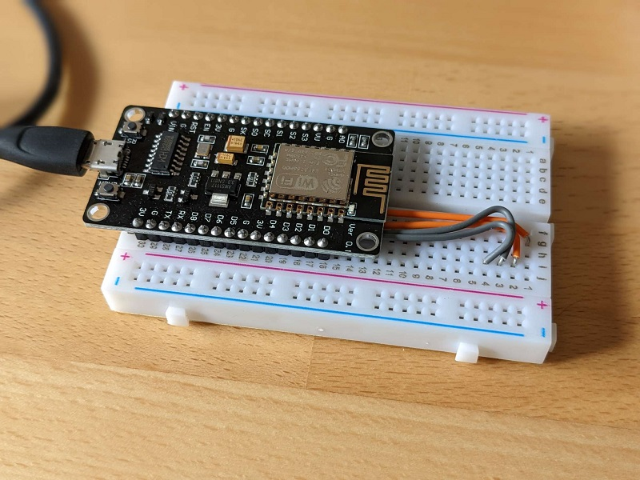

# nodemcu 
Code for NodeMcu V3 boards.

Developed with [Arduino](https://www.arduino.cc/en/software) (currently v1.8.19) and the esp8266 board package (currently v3.0.2).

## the setup
I am using the NodeMcu board mounted on a mini breadboard (400 pins).

The setup is run with an external USB power supply. This won't run on battery power (at least not more than some hours), no measures have been taken to minimize power consumption!
